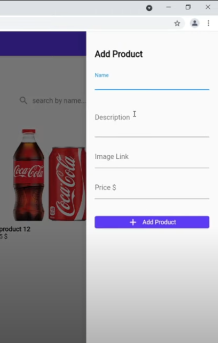
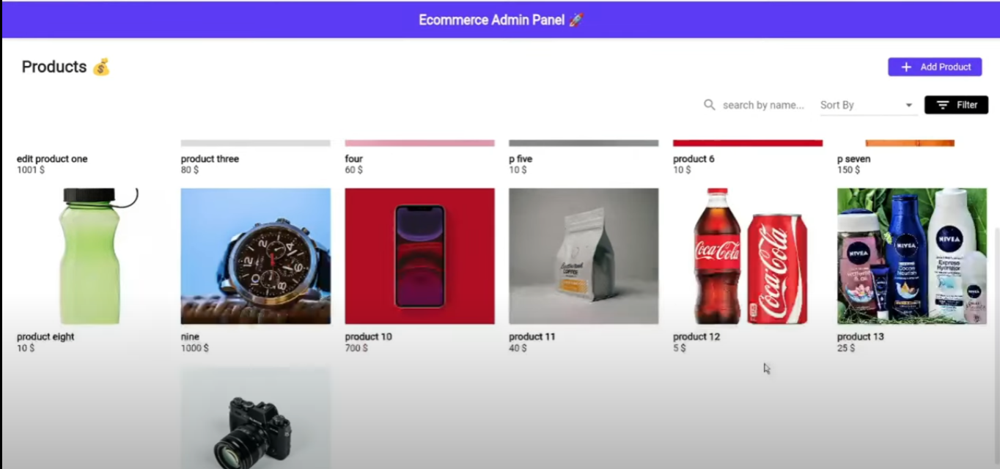

# Admin Panel

This is a simple full-stack project built using Flutter for the frontend and Java with Spring Boot for the backend. The project allows users to perform CRUD (Create, Read, Update, Delete) operations on products, as well as search, filter, and order them.

## Tech Stacks

- **Flutter**: A popular framework for building natively compiled applications for mobile, web, and desktop from a single codebase.
- **Spring Boot**: An open-source Java-based framework used to create microservices and standalone applications.
- **Lombok**: A Java library that helps to reduce boilerplate code in Java classes.
- **h2database**: A Java SQL database that is embedded in-memory, providing easy database setup for development and testing purposes.

## Features

- **Create**: Users can add new products to the system.
- **Read**: Users can view the list of products available in the system.
- **Update**: Users can edit the details of existing products.
- **Delete**: Users can remove products from the system.
- **Search**: Users can search for products by name or any other relevant criteria.
- **Order**: Users can sort the list of products based on attributes such as price.
- **Filter**: Users can apply filters to narrow down the list of products based on specific criteria.

## Screenshots

These screenshots provide a glimpse of the user interface of the Admin Panel, showcasing its simple and intuitive design with added search, order, and filter functionalities.
